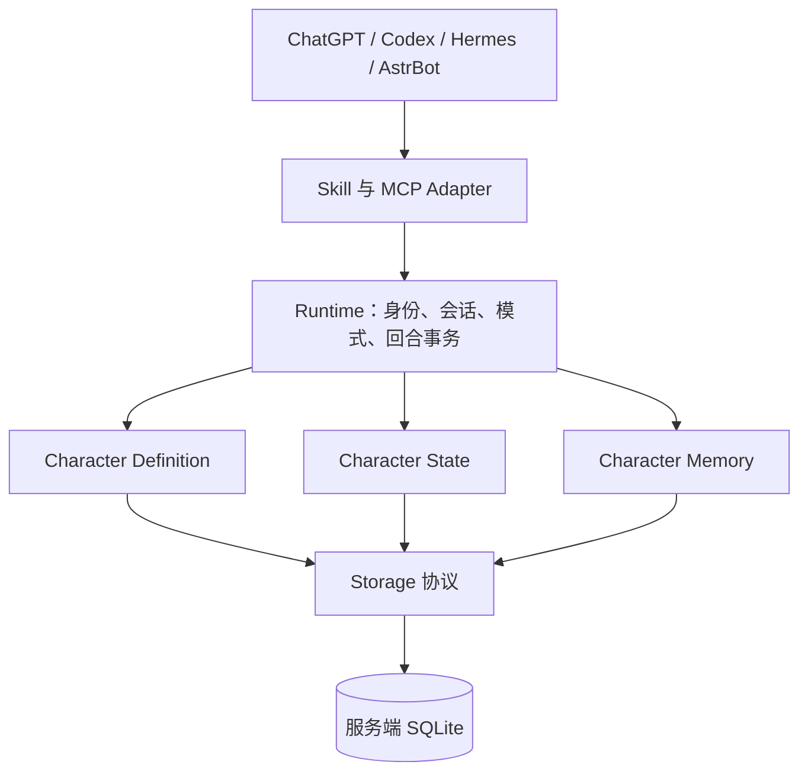

# Character Runtime

平台无关的角色持久运行时。角色定义、当前状态、记忆分开存储，宿主模型负责理解与表达，Runtime 负责隔离、生命周期、状态转换和迁移。Python 3.11+，SQLite，官方 MCP Python SDK 2.2.0；没有模型 API Key 或网页后台前置要求。

**本地审计版本 0.1.0。尚未上传、发布或部署。** 中断点追加复核与修复见 [问题清单](docs/interruption-review.md)。 ChatGPT 手机是远程接入目标；交付了认证 HTTP 后端与接入说明，尚未在手机/真实 OAuth 提供方上完成端到端验收。

## 立即运行本地演示

安装 Python 3.11+ 与 [uv](https://docs.astral.sh/uv/getting-started/installation/)，进入本目录：

```text
uv sync --locked --python 3.11
uv run --locked python -m character_runtime.demo
```

演示使用真实 MCP stdio 客户端和两个独立服务进程，验证创建、持久化、重启召回、角色隔离、OOC/任务恢复、记忆提升、导入导出、遗忘。数据全部为合成内容，运行后临时数据库自动删除。它是确定性协议/状态演示，不调用 LLM，也不把固定候选当作模型判断。[本次实际演示记录](docs/demo.md)另列当前助手参与的角色对话。

## 连接宿主开始角色对话

1. 按 [adapters/codex.example.toml](adapters/codex.example.toml) 配置本地 MCP，替换项目与私有数据目录路径。服务命令为 `uv run --locked python -m character_runtime serve --transport stdio`。
2. 将 [角色工作流 Skill](skills/character-runtime/SKILL.md) 加入宿主支持的 Skill/指令机制，或在支持的客户端加载本地 Plugin 包。此仓库没有修改你的全局配置。
3. 对宿主说：“创建一个安静、可靠的灯塔守望者，叫林舟；今后这个对话使用他。”宿主创建并激活角色，每轮读取上下文、提交有价值记忆。
4. 后续可说“进入 OOC”“改称呼”“删除这条记忆”“本次任务用中性模式，完成后恢复”“导出角色，不含记忆”。也可使用 [结构化示例](examples/original-character.json) 创建角色。

插件只打包规则，需另外连接 MCP 后端；仅装 Skill 不会产生持久化。端点与账号注册信息不会伪造。ChatGPT/Hermes/AstrBot 和跨设备接入见 [适配文档](docs/adapters.md)。

## 结构与架构

```text
character_runtime/
  models.py                 Definition / State / Memory / Package
  characters.py runtime.py  来源优先级、会话、模式、原子回合
  memory.py growth.py       命名空间、生命周期、循证成长
  packages.py storage.py    可迁移 JSON、事务 Storage / SQLite
  server.py auth.py cli.py  MCP、认证、跨平台入口
  demo.py                   可重复的真实协议演示
skills/character-runtime/   宿主自然语言角色工作流
adapters/                  Codex / Hermes / AstrBot 配置示例
schemas/ examples/         版本化契约与原创角色卡
scripts/ tests/ docs/      Schema 生成、测试与说明
plugin.json .codex-plugin/ 分发元数据
```



核心不导入 MCP；所有宿主使用同一模型和后端。手机只访问认证 HTTP 服务，不读取开发机文件。SQLite 是可替换的服务端 Storage 实现。

## 验证与文档

```text
uv run --locked python -m unittest discover -s tests -v
uv run --locked ruff check .
uv run --locked ruff format --check .
uv run --locked mypy character_runtime
uv build --build-constraints build-constraints.txt
```

- [设计与官方依据](docs/design.md)：技术选择、架构、来源优先级、平台机制。
- [数据与隐私契约](docs/reference.md)：Schema、Memory、成长、版本迁移、安全边界。
- [适配与运行配置](docs/adapters.md)：10 个 MCP 工具、认证、各平台接入。
- [开发与测试](docs/development.md)：构建、Schema、清理、跨平台验证状态。
- [实际演示](docs/demo.md)与[审计报告](docs/audit.md)：已验证内容、限制与审计清单。

V1 的自动提取、角色表现和真实用户授权识别依赖宿主遵守工作流；MCP 不会强制模型每轮调工具。成长默认缓慢，角色之间默认不共享，现实记忆必须显式提升，导出默认无 Memory。详见数据契约，不把这些机制宣传为完全自动或无条件隐私保证。
